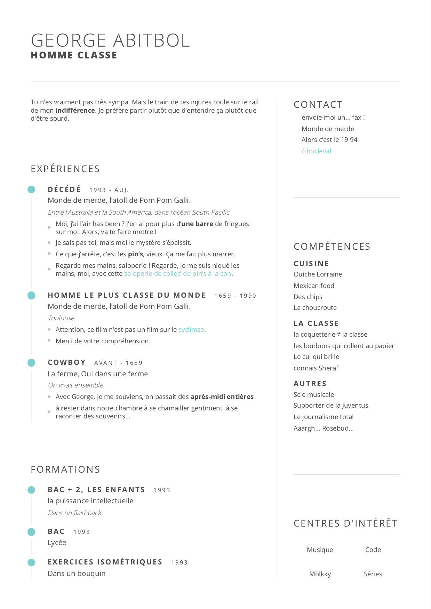
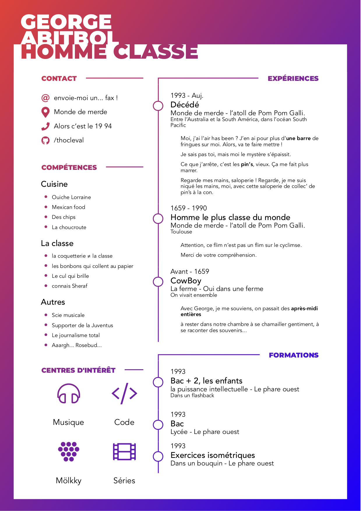

# CV generator

Dynamically generate CVs using various templates.

****

## Templates

### Modern


### Gradient


### Add yours ?

****

## How to use

### Customisation
Use the different `.pug` files in `./content` to add your own details.

### PDF generation

The resume is generated from `.pug` and `.scss` to `.pdf` with [RelaxedJS](https://github.com/RelaxedJS/ReLaXed)

If need to install it, run :

``` bash
# Installation of dependency
npm i -g relaxedjs
```
Then simply run the script

``` bash
# Generating CVs
./generate.sh
```

This will generate a 'PDFs' directory containing all your generated CVs, Enjoy !

### Make it you own

Don't be afraid to tinker with it, change colours, type-faces, etc. The sky is the limit !

**Disclaimer** : Due to the nature of CVs these templates are quite fragiles and depend a lot on the content you put in. It might not come out perfectly the first time you use this but don't give up it's usually easy to fix.
